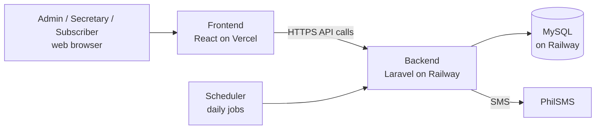

# SWIFT documentation

SWIFT is the subscription, billing and notification system for Jubal Brothers Cable TV Corporation, Palayan Branch. These pages describe how it is deployed and how it behaves. They were written from the code, so where something depends on a company decision or on settings that live outside the repository, the page says **To confirm**.

| Page | What it covers |
|---|---|
| [Deployment and releases](deployment.md) | Where the system runs, the two environments, how a change reaches production, settings, migrations and seeders, how to create the first admin, logs, rollback |
| [Automated jobs and SMS](automation.md) | The scheduled jobs, what triggers every SMS, time zone, how to confirm the scheduler runs |
| [Billing and payments](billing-and-payments.md) | How balances, months behind, advance credit and statuses are calculated; the payment workflow; what is not handled by the system |
| [Roles and permissions](roles-and-permissions.md) | What an admin, a secretary and a subscriber can do |
| [Offline behaviour and errors](offline-and-errors.md) | What happens without a connection, and how errors and limits are shown |
| [Features added after the first evaluation](features.md) | Audit trail, per-secretary permissions, phone verification, payment receipts, table cards on phones |
| [Future improvements](future-improvements.md) | Ideas that are not built yet, such as email reminders and online payment |
| [Flowcharts](flowcharts.md) | Registration and activation, recording a payment, status lifecycle, overdue accounts, advance payment and refund, release flow |

## The system in one picture

| Part | Technology | Hosted on |
|---|---|---|
| Frontend | React, Vite, Tailwind | Vercel |
| Backend API | Laravel (PHP 8.3), Sanctum tokens | Railway |
| Database | MySQL | Railway |
| SMS | PhilSMS (Globe network only, see [Automated jobs and SMS](automation.md)) | PhilSMS |
