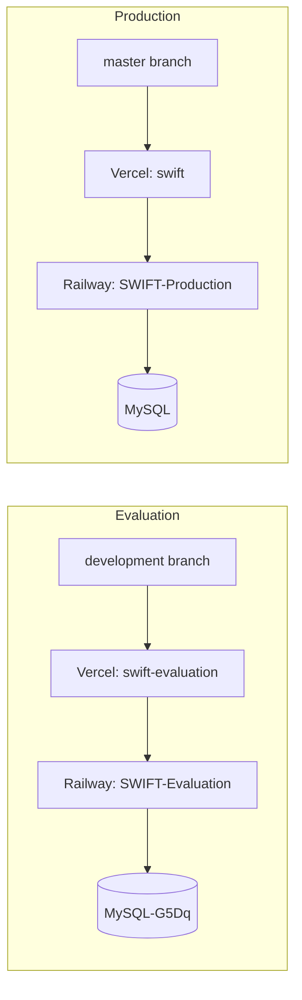

# Deployment and releases

## Environments

There are two complete copies of the system. They share the same code but have separate databases, so testing never touches real data.

| | Production | Evaluation (testing) |
|---|---|---|
| Purpose | Real use by the company | Trying changes before release |
| Git branch | `master` | `development` |
| Frontend (Vercel project) | `swift` , `swift-jbc.vercel.app` | `swift-evaluation` , `swift-evaluation.vercel.app` |
| Backend (Railway service) | `SWIFT-Production` , `swift-production-65b7.up.railway.app` | `SWIFT-Evaluation` , `swift-evaluation.up.railway.app` |
| Database (Railway) | `MySQL` | `MySQL-G5Dq` |
| SMS | Real messages | Disabled, so no real person is texted |

Each frontend knows which backend to talk to through the variable `VITE_API_URL` (see below). Each backend only accepts requests from its own frontend, set by `FRONTEND_URL`.

## How a change reaches production

1. Make a branch from `development` and open a pull request **into `development`**.
2. GitHub runs three required checks: **Base branch guard**, **Frontend build** and **Backend tests**. All must pass.
3. After the merge, Vercel and Railway deploy `development` to the **evaluation** site. Test there.
4. When it works, open a pull request **from `development` into `master`**. The Base branch guard blocks a pull request into `master` from any other branch.
5. After that merge, Vercel and Railway deploy `master` to **production**.

`master` is protected: changes only arrive through a pull request, history cannot be rewritten, and the branch cannot be deleted.

> Always check the **base branch** shown on a pull request before merging. A pull request opened into `master` by mistake will fail the guard.

### Release checklist

- [ ] Take a database backup if the release contains a migration (Railway: the MySQL service, then Backups, or a dump).
- [ ] Smoke test on the evaluation site with an admin, a secretary and a subscriber account.
- [ ] Merge the release pull request.
- [ ] Watch the deploy logs on Railway and Vercel until both finish.
- [ ] Log in once on the live site and open Subscribers, Payments and Reports.

### Rolling back

- **Frontend (Vercel):** open the project, then Deployments, choose a previous good deployment, and use **Instant Rollback** or **Promote to Production**.
- **Backend (Railway):** open the service, then Deployments, and redeploy the previous successful deployment.
- **Database:** migrations are not undone automatically. A rollback of the code does not remove columns a migration added. The migrations so far only add things, so older code keeps working with them.

## Settings (environment variables)

Settings are not stored in the repository. They are set in each service's dashboard. The files `Backend/.env.example` and `Frontend/.env.example` list the names.

**Backend (Railway)**

| Variable | Meaning |
|---|---|
| `APP_ENV` | `production` on both live services |
| `APP_DEBUG` | Must be `false` on anything on the internet, otherwise error pages expose internals |
| `APP_KEY` | Laravel secret key, unique per environment, never shared |
| `APP_URL` | The backend's own public address |
| `DB_*` | Connection to that environment's MySQL service |
| `FRONTEND_URL` | The frontend address allowed to call this API (CORS). Several addresses can be separated by commas |
| `PHILSMS_API_TOKEN`, `PHILSMS_SENDER_ID` | SMS provider. Leave the token empty on evaluation so no SMS is sent |
| `RATE_LIMIT_ENABLED` and `RATE_LIMIT_*_PER_MIN` / `_PER_HOUR` | Request limits (login 5 a minute, registration 5 an hour, SMS 10 a minute, report views 60 a minute, report downloads 15 a minute). Can be raised or switched off on evaluation |
| `ALLOW_DEMO_SEED`, `SEED_DEMO_PASSWORD` | Only for the demo seeder, see below |

**Frontend (Vercel)**

| Variable | Meaning |
|---|---|
| `VITE_API_URL` | The backend API address, ending in `/api`. It is baked in when the frontend is built, so **changing it needs a redeploy** |

## Migrations and seeders

- **Migrations** change the database structure. They must run on every deploy that adds one: `php artisan migrate --force`. **To confirm:** how Railway runs this (start command or a pre-deploy command) is set in the Railway dashboard, not in the repository. If the Archive page works on the evaluation site, that environment runs migrations automatically.
- **Seeders** put starting data in a database. The default seeder creates demo accounts and fake subscribers, so it is for development and testing only. In production it does nothing unless `ALLOW_DEMO_SEED=true` and a `SEED_DEMO_PASSWORD` of your own are set. Seeders are only suitable for reference data that carries no value (for example dropdown options), never for real accounts or passwords.
- **First real admin:** run `php artisan swift:create-admin` on the service. It asks for a name, an email and a password of at least 12 characters.

## Logs and monitoring

- **Backend:** Railway, the service, then Deployments, then View logs. Laravel's own log is written inside the service and is lost when it redeploys, so use the Railway logs.
- **Frontend:** Vercel, the project, then Logs and Deployments.
- **CPU and memory:** Railway, the service, then Metrics.

## Scheduler

The two daily jobs need something to run `php artisan schedule:run` regularly. See [Automated jobs and SMS](automation.md).

## Common problems

| Symptom | Likely cause |
|---|---|
| Browser shows a CORS error | `FRONTEND_URL` on the backend does not match the frontend address |
| Frontend still calls the old API after changing `VITE_API_URL` | The frontend was not redeployed |
| "Too many attempts" | A rate limit was hit. Wait a minute, or raise the limit |
| Cannot log in on evaluation with a production account | Different databases, so accounts do not carry over |
