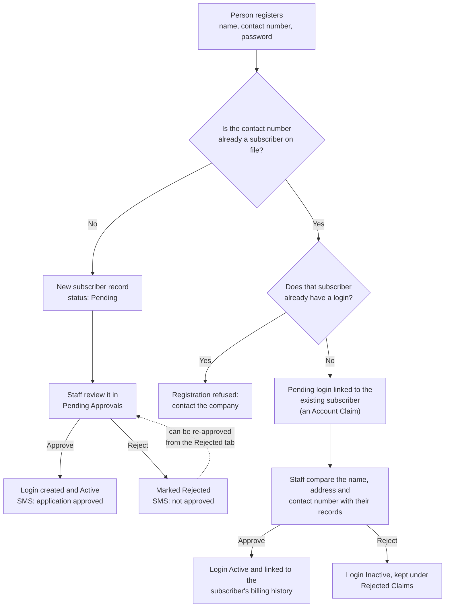
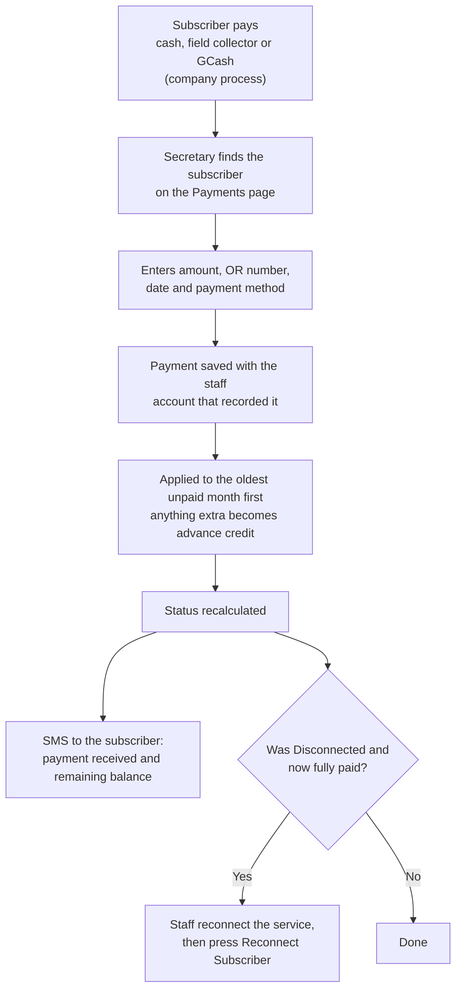
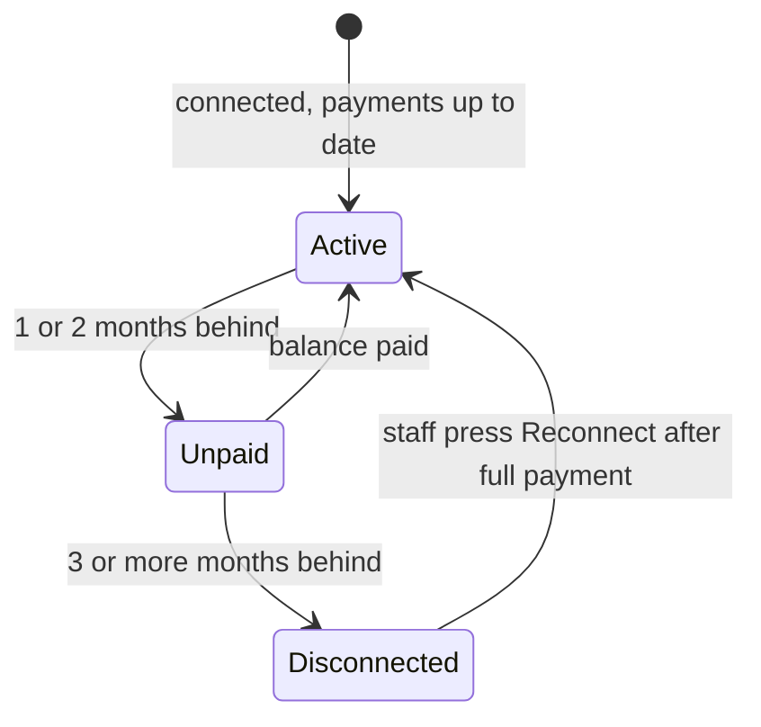
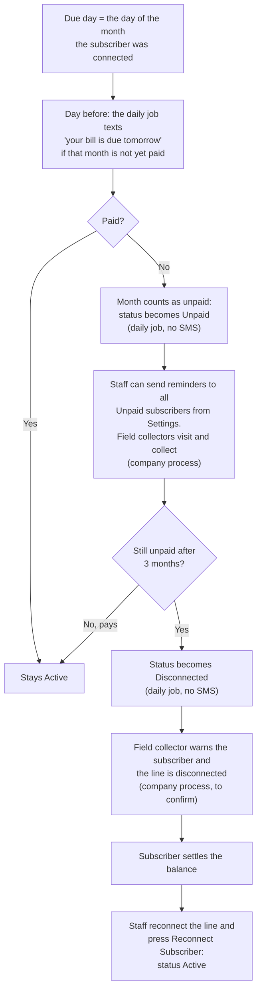
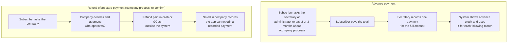
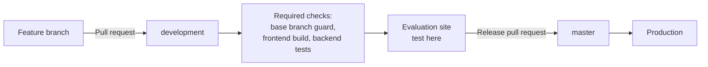

# Flowcharts

These diagrams are written in Mermaid, so GitHub draws them when you open this page. To use one in a paper, open the page on GitHub and take a screenshot, or paste the diagram code into <https://mermaid.live> and export it as an image or SVG.

Boxes marked **company process** are done by people, not by the system. Wording of those steps should be confirmed with the company.

## 1. Registration and activation

A person registers with a name, contact number and password (email is optional). What happens next depends on whether the contact number is already on file.

## 2. Recording a payment

## 3. Subscriber status

Statuses are recalculated by the system. Only a staff member can take a subscriber out of Disconnected.

## 4. Due date, overdue accounts, notification and disconnection

## 5. Advance payment and refund

## 6. How a change reaches production

Details and the release checklist are in [Deployment and releases](deployment.md).
